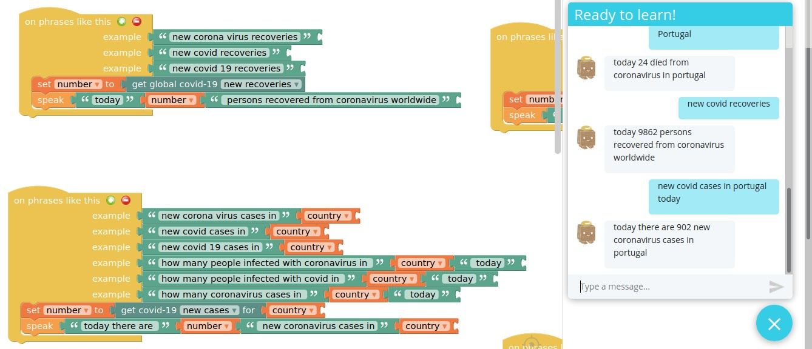

# Coronavirus - Chatterbox Skill

All the numbers regarding the Corona Virus pandemic

Using chatterbox web_apis extensions you can query the [Covid19 API](https://covid19api.com/)

Examples

    "how many deaths from coronavirus in {Country} today?"
    "how many people were infected with coronavirus in {Country} today?"
    "Total corona virus deaths"
    "Total corona virus recoveries"
    "New corona virus cases"

